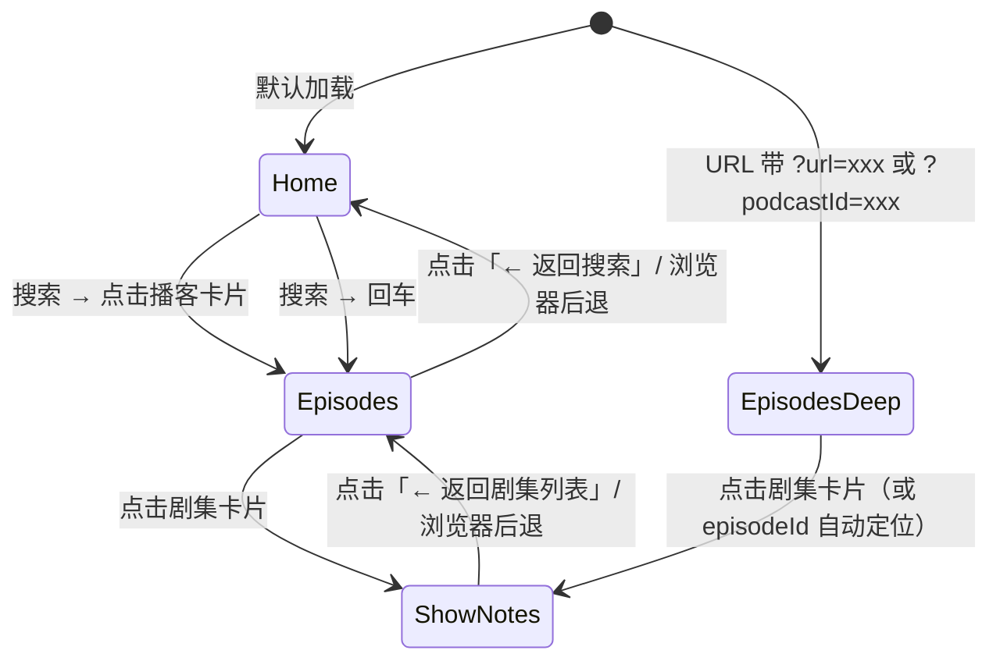
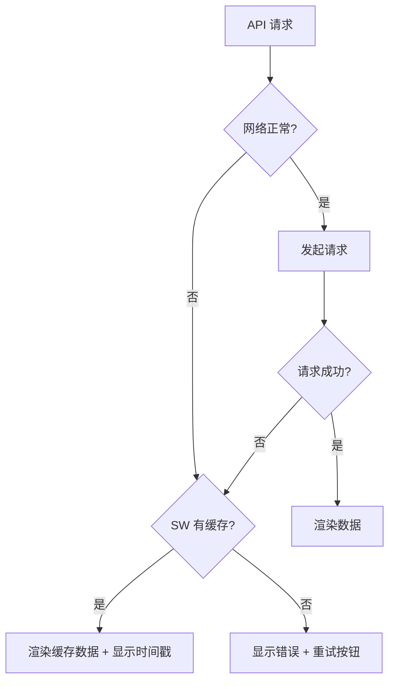

# 播客 Shownotes — 开发规格书

> **目标：** 用户在 Apple Podcasts 收听节目时，通过 iOS Shortcut 一键跳转到 PWA 查看当前播客的图文 Show Notes。  
> **部署：** GitHub Pages（免费 HTTPS + 全球 CDN）  
> **终端：** PWA（可添加到桌面，离线缓存，体验接近原生 App）

---

## 一、架构总览

```
┌──────────────────────────────────────────────────────────────────┐
│                        用户操作流程                                │
│                                                                  │
│  🎧 Apple Podcasts                                               │
│       │ 点击 Share → Share Episode                                │
│       ▼                                                          │
│  📤 Share Sheet                                                  │
│       │ 选择「播客 Shownotes」Shortcut                             │
│       ▼                                                          │
│  ⚡ Shortcut（本地）                                               │
│     • 接收 URL: https://podcasts.apple.com/.../id1253186678?i=xxx│
│     • 透传: https://shownotes.example.com/?url={原始URL编码}       │
│     • Open URL → Safari                                          │
│       ▼                                                          │
│  🌐 PWA（GitHub Pages）                                           │
│     • 解析 URL 参数 → 提取 collectionId + episodeId               │
│     • iTunes Lookup API → 获取播客信息 + feedUrl                   │
│     • 直接 fetch RSS → DOMParser 解析 XML → 提取 Show Notes       │
│     • 渲染：优美 CSS 排版（支持暗色模式 + 手动切换）                  │
│     • SW 缓存：下次同一播客秒开（即使离线）                          │
│                                                                  │
└──────────────────────────────────────────────────────────────────┘
```

---

## 二、PWA 规格

### 2.1 文件结构

```
repo-root/
├── index.html          # 主页面（单文件 SPA）
├── manifest.json       # PWA 清单
├── sw.js               # Service Worker
├── icon-192.png        # PWA 图标 192×192
├── icon-512.png        # PWA 图标 512×512
├── README.md           # 项目说明
└── CNAME               # 可选：自定义域名
```

### 2.2 页面状态机



### 2.3 URL 路由（Hash 路由）

| URL | 视图 | 说明 |
|-----|------|------|
| `/` | Home | 搜索框 + 空状态引导 |
| `/?url=https://podcasts.apple.com/.../id1253186678?i=xxx` | Episodes（Deep Link） | Shortcut 透传原始 URL，PWA 自动解析并加载 |
| `/?podcastId=1253186678` | Episodes（Deep Link） | 兼容旧格式：仅传 podcastId |
| `/#episodes/1253186678` | Episodes | 用户搜索/点击后，pushState 生成可分享 URL |
| `/#shownotes/1253186678/episodeIdx` | ShowNotes | 点击剧集后，pushState 生成可分享 URL |

**路由实现要点：**
- `history.pushState` + `popstate` 监听 → 浏览器后退键正常工作
- 每个视图有独立可分享 URL
- Deep link 参数（`?url=` / `?podcastId=`）加载后自动转换为 hash 路由
- 支持 `episodeId` 参数时，自动滚动到对应剧集并高亮

### 2.4 API 调用链

#### 搜索播客
```
GET https://itunes.apple.com/search
  ?term={用户输入}
  &media=podcast
  &entity=podcast
  &limit=20
  &country=cn

→ 响应: { results: [{ collectionName, artistName, artworkUrl100, feedUrl, trackCount, primaryGenreName, ... }] }
```

#### Deep Link：按 ID 获取播客
```
GET https://itunes.apple.com/lookup
  ?id={podcastId}

→ 响应: { results: [{ collectionName, artistName, artworkUrl600, feedUrl, ... }] }
```

#### 获取剧集（前端直接解析 RSS）
```
1. fetch(feedUrl) → 获取 RSS XML
2. new DOMParser().parseFromString(xml, 'text/xml')
3. 解析 <item> 节点：

   items = [...doc.querySelectorAll('item')].map(item => ({
     title:       item.querySelector('title')?.textContent,
     pubDate:     item.querySelector('pubDate')?.textContent,
     link:        item.querySelector('link')?.textContent,
     content:     item.querySelector('content\\:encoded, encoded')?.textContent
                || item.querySelector('description')?.textContent,
     enclosure:   item.querySelector('enclosure')?.getAttribute('url'),
     duration:    item.querySelector('itunes\\:duration')?.textContent,
   }));
```

**降级方案：** 若 RSS 源 CORS 被阻止，依次尝试：
1. `https://api.allorigins.win/raw?url=` + encodeURIComponent(feedUrl)
2. `https://api.rss2json.com/v1/api.json?rss_url=` + encodeURIComponent(feedUrl)（备用，有免费额度限制）

### 2.5 降级与容错



**具体策略：**

| 场景 | 处理 |
|------|------|
| iTunes API 失败 | 显示友好错误 + "返回首页"按钮 |
| RSS fetch 失败（网络） | 按降级链尝试 CORS 代理 → rss2json |
| RSS fetch 失败（CORS） | 自动切换到 CORS 代理重试 |
| 所有 RSS 获取方式均失败 | 显示 "RSS 源暂时不可用" |
| RSS 返回空 items | 显示 "该播客没有剧集" |
| 离线访问已缓存的播客 | 显示缓存内容 + 顶部黄色 "📡 当前离线" 横幅 |
| 播客无 feedUrl | 显示 "该播客没有 RSS Feed" |
| URL 参数含 episodeId | 自动滚动到对应剧集并高亮提示 |

### 2.6 Service Worker 缓存策略

| 资源类型 | 策略 | TTL |
|----------|------|-----|
| App Shell（HTML/CSS/JS/manifest/图标） | **Cache First**，后台更新 | 永久（版本号控制更新） |
| iTunes API 响应 | **Network First**，失败回退缓存 | 24 小时 |
| RSS Feed（元数据） | **Network First**，失败回退缓存 | 1 小时 |
| 单集 Show Notes HTML | **Network First**，失败回退缓存 | 24 小时 |
| 播客封面图 | **Cache First** | 7 天 |

### 2.7 CSS 排版覆盖的 Shownotes 元素

- ✅ 标题层级（h1/h2/h3）— 加粗、间距分明
- ✅ 段落（p）— 舒适的 1.8 行高
- ✅ 加粗（strong/b）、斜体（em/i）
- ✅ 超链接（a）— 主题色 + 可点击
- ✅ 图片（img）— `max-width: 100%` 自适应宽度、圆角
- ✅ 引用块（blockquote）— 左侧主题色竖线 + 灰底
- ✅ 有序/无序列表（ol/ul/li）
- ✅ 代码块（pre/code）— 灰底等宽字体
- ✅ 表格（table/thead/tbody/tr/th/td）
- ✅ 分隔线（hr）
- ✅ 隐藏 iframe（播客播放器通常不需要）
- ✅ 暗色模式（自动跟随系统 `prefers-color-scheme` + 手动切换按钮）

### 2.8 PWA 安装体验

| 平台 | 行为 |
|------|------|
| **iOS Safari** | 底部弹出 "Add to Home Screen" → 桌面出现图标 → 全屏 standalone 打开（无浏览器边框） |
| **Android Chrome** | 自动弹出安装提示 |
| **桌面 Chrome** | 地址栏右侧出现安装图标 |

### 2.9 技术约束

- **必须 HTTPS：** GitHub Pages 自带
- **Service Worker 作用域：** 必须在根路径 `/`，即 repo 根目录放文件
- **manifest.json `start_url`：** 设为 `/` 以保证从桌面图标打开时正确加载
- **CORS：** iTunes API 支持跨域；RSS Feed 通过前端直接解析 + CORS 代理降级链处理
- **搜索地区：** iTunes Search API 不限制 `country` 参数，默认搜索全球播客（可在设置中指定地区）
- **不需要任何框架：** 纯原生 HTML/CSS/JS，零依赖，零构建步骤

---

## 三、iOS Shortcut 规格

### 3.1 Shortcut 名称

`播客 Shownotes`

### 3.2 触发方式

Apple Podcasts → 点 Share（分享按钮）→ 在 Share Sheet 中选择 Shortcut

### 3.3 输入

Apple Podcasts 分享的节目 URL，格式为：

```
https://podcasts.apple.com/{country}/podcast/{name}/id{collectionId}?i={episodeId}
```

示例：
```
https://podcasts.apple.com/us/podcast/syntax-tasty-web-development-treats/id1253186678?i=1000678901234
```

### 3.4 处理逻辑（伪代码）

```
1. 接收输入 → Get URL from Share Sheet Input
2. URL 编码原始 Apple Podcasts URL:
   - encoded = encodeURIComponent(input)
3. 拼接目标 URL:
   - target = "https://{DEPLOY_DOMAIN}/?url=" + encoded
   - 例如: "https://shownotes.example.com/?url=https%3A%2F%2Fpodcasts.apple.com%2Fus%2Fpodcast%2F...%2Fid1253186678%3Fi%3D1000678901234"
4. Open URL → 调用 Safari 打开 target

PWA 端负责：
  - 解析 url 参数
  - 正则提取 collectionId (/id(\d+)/)
  - 正则提取 episodeId (/\?i=(\d+)/)（可选）
  - 加载播客信息 + 剧集列表
  - 若有 episodeId，自动定位到对应剧集
```

**设计原则：** Shortcut 只做 URL 透传 + 编码，所有解析逻辑收归 PWA。
好处：改逻辑只改 PWA，用户无需重装 Shortcut。

### 3.5 Shortcut 创建步骤（在 iPhone 的 Shortcuts App 中操作）

| 步骤 | 操作 | 说明 |
|------|------|------|
| 1 | 新建 Shortcut | 点击 + |
| 2 | 添加 Action: **"Get URLs from Input"** | 接收 Share Sheet 传来的 URL |
| 3 | 添加 Action: **"URL Encode"** | 对原始 URL 进行编码 |
| 4 | 添加 Action: **"Text"** | 内容：`https://YOUR_DOMAIN/?url=` |
| 5 | 添加 Action: **"Combine Text"** | 将上一步 Text + 编码后的 URL 拼接 |
| 6 | 添加 Action: **"Open URL"** | 打开拼接后的 URL |
| 7 | 保存 | 命名为「播客 Shownotes」 |
| 8 | 设置 → Share Sheet 中显示 | 开启，选择接收类型：URLs |

### 3.6 Shortcut 配置截图说明

```
┌────────────────────────────────┐
│  ⚡ 播客 Shownotes              │
│                                │
│  Receive [URLs] input from     │
│      [Share Sheet]             │
│  If there's no input:          │
│      [Continue]                │
│                                │
│  URL Encode [Shortcut Input]   │
│      [Encode]                  │
│                                │
│  Text [https://YOUR_DOMAIN/    │
│       ?url=]                   │
│                                │
│  Combine [Text] with           │
│      [Encoded URL]             │
│                                │
│  Open [Combined Text]          │
│      in [Safari]               │
│                                │
└────────────────────────────────┘
```

---

## 四、GitHub Pages 部署规格

### 4.1 仓库设置

```
仓库名: podcast-shownotes（或其他任意名称）
可见性: Public（GitHub Pages 免费）
分支: main
部署目录: / (root) 或 /docs
```

### 4.2 部署步骤

```bash
# 1. 初始化仓库
git init
git add index.html manifest.json sw.js icon-192.png icon-512.png README.md
git commit -m "feat: podcast shownotes PWA"
git branch -M main
git remote add origin git@github.com:USERNAME/podcast-shownotes.git
git push -u origin main

# 2. GitHub 设置
# Settings → Pages → Source: Deploy from a branch
# Branch: main, folder: / (root) → Save

# 3. 等待 1-2 分钟，访问:
# https://USERNAME.github.io/podcast-shownotes/
```

### 4.3 验证清单

| 检查项 | 验证方法 |
|--------|----------|
| HTTPS 正常 | 浏览器访问 `https://USERNAME.github.io/podcast-shownotes/` |
| PWA manifest | Chrome DevTools → Application → Manifest |
| Service Worker | Chrome DevTools → Application → Service Workers（状态：activated） |
| 离线访问 | 断开网络 → 刷新页面 → 能显示（已缓存的）首页 |
| Deep link | 访问 `/?podcastId=1253186678` → 自动加载 Syntax 播客 |
| iOS Add to Home | Safari 打开 → Share → Add to Home Screen → 桌面出现图标 |
| iOS standalone | 从桌面图标打开 → 无 Safari 地址栏（fullscreen） |
| 暗色模式 | 切换系统暗色模式 → 页面自动切换暗色主题 |

---

## 五、部署后 Shortcut 配置

将 Shortcut 第 4 步（Text action）中的 `YOUR_DOMAIN` 替换为实际的 GitHub Pages 域名：

```
https://USERNAME.github.io/podcast-shownotes/?url=
```

如果你使用了自定义域名（通过 CNAME 文件）：

```
https://shownotes.yourdomain.com/?url=
```

---

## 六、文件内容规范

### 6.1 index.html

已在 `data/pwa/index.html` 中完整实现。关键功能清单：

- [x] 搜索播客（iTunes Search API，默认全球搜索）
- [x] Deep link 支持（URL 参数 `?url=` 透传 + `?podcastId=` 兼容旧格式）
- [x] episodeId 自动定位高亮
- [x] Hash 路由（可分享 URL + 浏览器后退正常）
- [x] 剧集列表 + 播客头部信息
- [x] Show Notes 富文本渲染
- [x] 暗色模式（自动跟随系统 + 手动切换）
- [x] 离线横幅提示
- [x] Service Worker 注册
- [x] manifest.json 链接
- [x] iOS meta 标签（apple-mobile-web-app-capable 等）
- [x] 响应式布局（max-width: 800px）
- [x] 点击态反馈（:active 缩放）
- [x] 安全区域适配（safe-area-inset）

### 6.2 manifest.json

```json
{
  "name": "播客 Shownotes",
  "short_name": "Shownotes",
  "start_url": "./",
  "scope": "./",
  "display": "standalone",
  "background_color": "#f8f9fa",
  "theme_color": "#5e5ce6",
  "icons": [
    { "src": "./icon-192.png", "sizes": "192x192", "type": "image/png" },
    { "src": "./icon-512.png", "sizes": "512x512", "type": "image/png" }
  ]
}
```

> **注意：** 使用相对路径 `./` 而非绝对路径 `/`，确保部署在子路径（如 `USERNAME.github.io/podcast-shownotes/`）和自定义域名两种场景下都能正常工作。

### 6.3 sw.js

缓存策略：
- App Shell：Cache First
- iTunes API：Network First → 缓存回退（24h TTL）
- RSS Feed：Network First → 缓存回退（1h TTL）
- 单集 Show Notes：Network First → 缓存回退（24h TTL）
- 播客封面图：Cache First（7 天）

---

## 七、附录：依赖的第三方服务

| 服务 | 用途 | 限制 | 是否必需 |
|------|------|------|:---:|
| **iTunes Search API** | 搜索播客 | ~20次/分钟 | ✅ 必需 |
| **iTunes Lookup API** | 按 ID 获取播客信息（Deep Link） | ~20次/分钟 | ✅ 必需 |
| **播客 RSS Feed** | 前端 DOMParser 直接解析 | 无限制（依赖 CORS） | ✅ 必需 |
| **allorigins.win** | CORS 代理（RSS 源被阻时的降级） | 免费额度充足 | ⚠️ 备用 |
| **rss2json.com** | RSS 解析降级方案 | 免费仅 10次/天 | ⚠️ 备用 |
| **GitHub Pages** | 静态托管 | 无限免费 | ✅ 必需 |
| **iOS Shortcuts App** | Share Sheet → 透传 URL → 跳转 | 需 iOS 12+ | ✅ 必需 |

---

## 八、后续增强（可选，不在本次范围）

- [ ] 图片代理（部分 RSS 图片被墙，需后端代理重写链接）
- [ ] 全文搜索 Show Notes
- [ ] 收藏播客（LocalStorage）
- [ ] 剧集播放功能（内嵌 audio 标签）
- [ ] PodcastIndex API 作为备用搜索源
- [ ] 自定义域名 + CloudBase 国内加速
- [ ] Shortcut 替代方案：支持通过 Universal Link 直接触发（免安装 Shortcut）